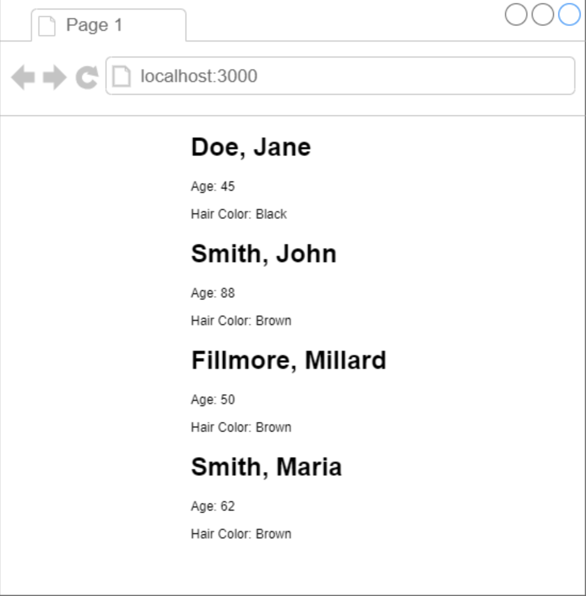
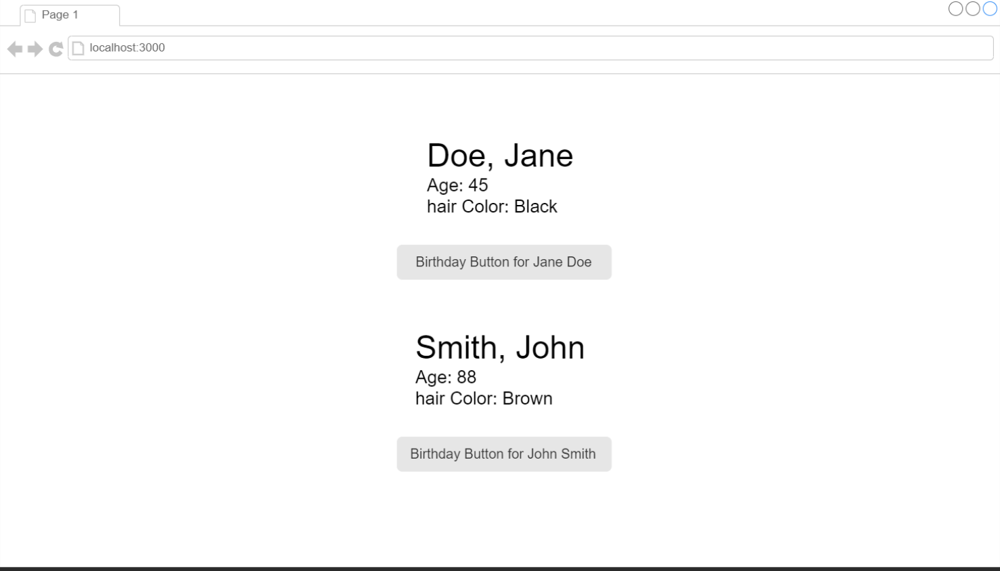

# Mern_Stack_Class_Components
  [Prop It Up](https://github.com/JordanNitta/Mern_Stack_Class_Components/tree/main/PropItUp)
  

  
  
  

  <a href="https://github.com/JordanNitta/Mern_Stack_Class_Components/tree/main/ReactBlocks">React Blocks</a>
  
